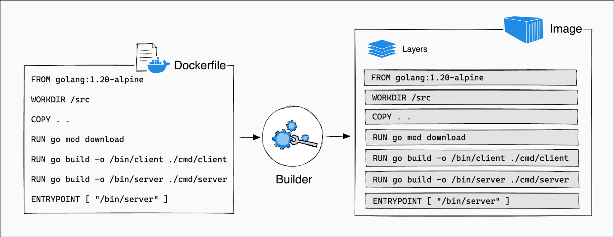
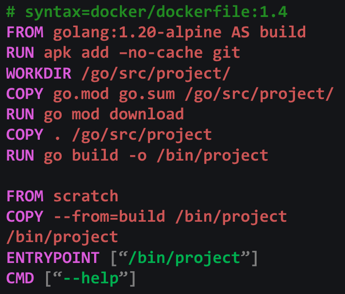
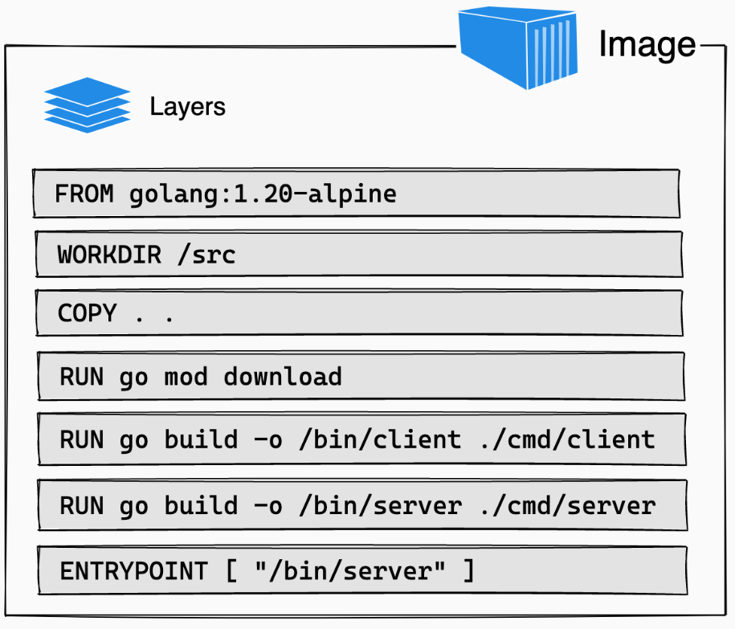
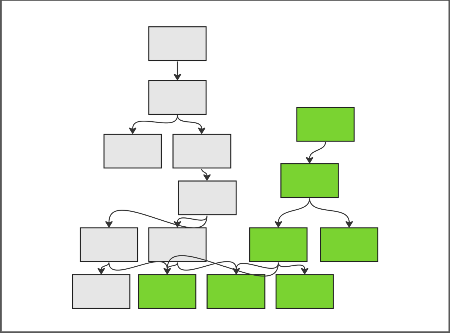
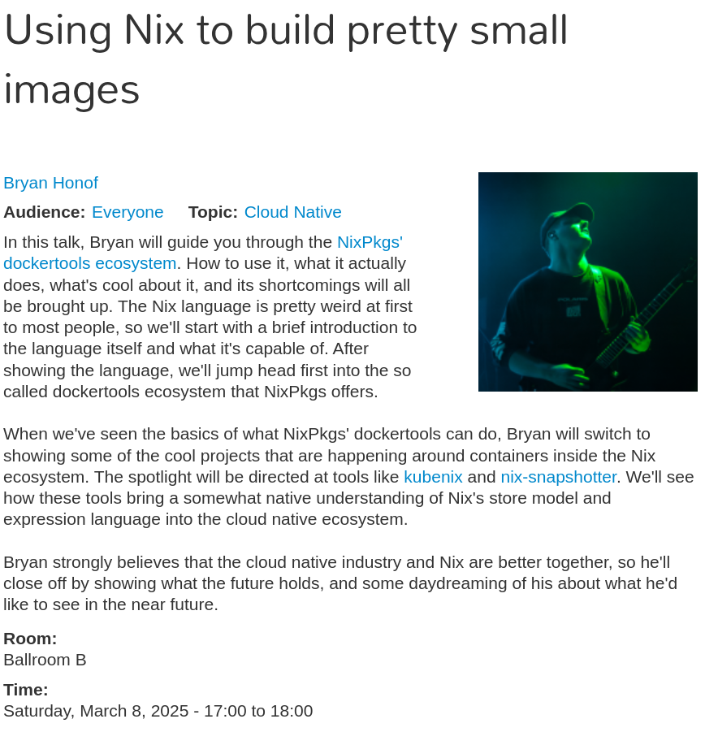

# Intro

* Who: Leigh and Tom
* What: Discuss the OCI layer paradigm and how to disrupt it.
* When: Right now!
* Where: PlanetNix @ SCALE 2025
* Why: Deploying into Kubernetes with Nix

---

# Getting started

- Containers are built from layers, but how many layers can you actually stack?  
- Why is there a limit, and what does it mean for your containerized applications?  
- How can I compose things?
- Let’s explore the constraints and how we can rethink layers with **Nix**.

::: notes
@Tom: 
:::
---

# Rule: Ask questions!

* If something isn't clear. Interrupt me.
* If you have any question. Interrupt me.
* No really... interrupt me, otherwise I will just keep talking.

{width=50% .center-img}

::: notes
@Tom: 
:::

---

# Agenda

0. **Introduction**: Containers and their limitations.
1. **Nix Storage and Packaging Basics**: Understand how Nix stores and manages packages.  
2. **OCI Image Make-Up**: Break down the anatomy of OCI images and their layers.  
3. **Demos**: See Nix in action with Kubernetes and container runtimes.  

::: notes
@Tom: 
:::

---

# Containers: A Fantastic Virtualization Technology

- Containers revolutionized virtualization by combining lightweight isolation with packaging capabilities.  
- They bundle applications and dependencies into portable, reproducible units.  
- Huge Cloud Native ecosystem build upon the core primitive.
- But are we fully leveraging their potential?  
- We often build containers in a layered fashion, do we have to?

::: notes
@Tom: 
:::

---

# Layers: a mental model for containers

{.center-img width=100%}

---

# Container generation 

## **Dockerfiles are amazing**
- simple mental model and easy to understand
- work effectively with low adoption hurdle
- large corpus of base images and examples

## **...but**
- how do we share?
- how to we manage bloat?
- how to apply best practices?
- how do we manage supply chain?

---

# Multi-stage builds

::: {style="float:left;width:50%;max-width:50%;"}
- Some cases are very easy...
- Some very hard.
- Dynamic libraries, scripting languages
- The simple mental model breaks down
- Language-specific support becomes more critical
- Runtime-only errors
:::

{width=50% style="float:right;"}

---

# Nix: a quick intro, pros

A declarative framework for package management, builds and deployments

## **Building software since 2003**
- Huge number of maintained packages
- Focused on correctness, provenance and reproducibility

## **Best-practices by default**
- Must build without network
- Must build without $HOME
- Must make dependencies explicit

--- 

# Nix: a quick intro, cons

## **Famous for a steep learning curve**
- documentation is improving
- focus of upstream
- Flox is working to expose a simpler interface

## **Perception problem**
- Large departure from alpine/debian
- Few enterprise users who speak publicly
- Flox Blog Series: Nix in the Wild
- Conferences: PlanetNix, NixCon

---

# Layers to Graphs

::: {style="float:left;width:50%;max-width:50%;"}

- `docker build`
    - linear
    - ordered list
    - leaves upon leaves

{width=80%}
:::

::: {style="float:right;width:50%;max-width:50%;"}
- `go build`, `npm build`, `nix build`, ...
    - tree-like
    - software re-use
    - distributed

{width=80%}
:::

---

# It's all about packaging

- Packaging is the art of making software re-usable.
- Containers are not a packaging format.
- "We develop a library, and deliver it as a container." ???
- While containers are great, we still need packaging.
- By refining the stack of bits that make up container image layers and OCI manifests, we unlock new cloud-native possibilities.  

::: notes
@Tom: 
:::

---

# Nix: Isolated Package Directories

- Normally we use the FHS (File Hierachy Standard)
	- `/usr/local/share`
	- `/usr/bin`
	- `/lib/`
	- etc...
- Nix uses a unique approach to package management:  
  - Each package is stored in a hashed folder, isolated from others.  
  - Packages can be combined or used independently, enabling reproducibility and flexibility.  
- This sounds a lot like a container registry
	- but with added benefits like atomic updates and no dependency conflicts.  

---

# Conflict-free layers
- OCI layers can be independent!
    - content addressed
    - still need to overlay and combine
    - check for conflicts, modifications
    - if they have conflicts, they cannot be re-ordered

- If each package is a conflict-free layer:
    - we can bind mount them (no layer limitations)
    - we can share them/ re-use them (better caching)
    - we can be confident they won’t interact in unexpected ways

::: notes
@Tom: 
:::

---

# Where are we today? and references

- [Optimizing Docker Layers - grahamc.com](https://grahamc.com/blog/nix-and-layered-docker-images/)
- [https://nixery.dev/]()
- Streaming container builds
- [nix-snapshotter - pdtpartners](https://github.com/pdtpartners/nix-snapshotter)
- [https://flox.dev/blog/nix-and-containers-why-not-both/]()
- Custom Layer Strategies: [Nixpkgs PR 122608](https://github.com/NixOS/nixpkgs/pull/122608)
- Local overlay stores
	- [Nix 2.25 Manual](https://nix.dev/manual/nix/2.25/command-ref/new-cli/nix3-help-stores#experimental-local-overlay-store)
	- [https://discourse.nixos.org/t/super-colliding-nix-stores/28462]()
	- [https://blog.replit.com/super-colliding-nix-stores]()

---

# Game plan - Optimizing Layers

::: incremental
1. Make each directory a layer.
2. Combine similar packages/directories into a similar layer.
3. Use automatic custom strategy to optimize.
4. Teach OCI to understand non-conflicting layers.
5. Create tooling so that packages use immutable references or content addressed paths.
6. ???
7. Profit
:::

---

# More about optimizing image sizes

{width=50% .center-img}

---

# Custom Layer Strategies

::: {width=100%}
::: {style="float:left;width:50%;max-width:50%;"}
- See Nixpkgs PR 122608 [https://github.com/NixOS/nixpkgs/pull/122608]()
- Allows for graph slicing, merging, filtering, manipulation.
:::

::: {style="float:right;width:50%;max-width:50%;"}

{width=100%}

:::

:::

Cut out Python from the rest of the graph:
```json
[
  ["subcomponent_out" [pkgs.python3]]
  ["over" "rest" ["pipe" [
        ["popularity_contest"]
        ["limit_layers" 100]
  ]]]
]
```

---

# Demo 1: Nix Expressions to Build Containers

- Use Nix expressions to define and build container images.  
- Benefits:  
  - Reproducible builds.  
  - Fine-grained control over dependencies.  
  - No more "it works on my machine" issues.  
- Showcase custom layering strategies.

::: notes
@Tom: 
:::

---

# Demo 2: Node-Local Nix Stores

- Deploy node-local Nix stores in Kubernetes clusters.  
- Use per-container overlay caches for dynamic dependencies.  
- Benefits:  
  - Efficient dependency management for container workloads.  
  - Reduced network overhead for pulling dependencies.  

::: notes
@Tom: 
:::

---

# Demo 3: Image volumes

- Use an image volume per Nix Store directory.
- Benefits:  
  - Uses Kubernetes-native features to define the image.
  - Efficient mounting and reuse.
  - Reduced network overhead for pulling dependencies.  

::: notes
@Tom: 
:::

---

# Demo 4: Nix-Snapshotter with Containerd

- Replace traditional container layers with Nix store paths.  
- **nix-snapshotter**: A containerd plugin that pulls dependencies directly from the Nix store.  
- Advantages:  
  - Smaller image sizes.  
  - Made up of fine-grained components, not layers.
  - Faster container startup times.  
  - No need for redundant layers in registries.  

::: notes
@Tom: 
:::

---

# What now? Call-to-action

{style="float:right" width=40%}

- Nix brings reproducibility, flexibility, and efficiency to containerized workflows.  
- Kubernetes provides the orchestration layer to scale these benefits across clusters.  
- Together, they enable a new paradigm for cloud-native development.  
- Explore efficiency gains.
- Improve support for conflict-free composition in container runtimes.
- Reach out to us if you are interested in these topics.
- Have fun!


::: notes
@Tom: 
:::

---

# Questions?
