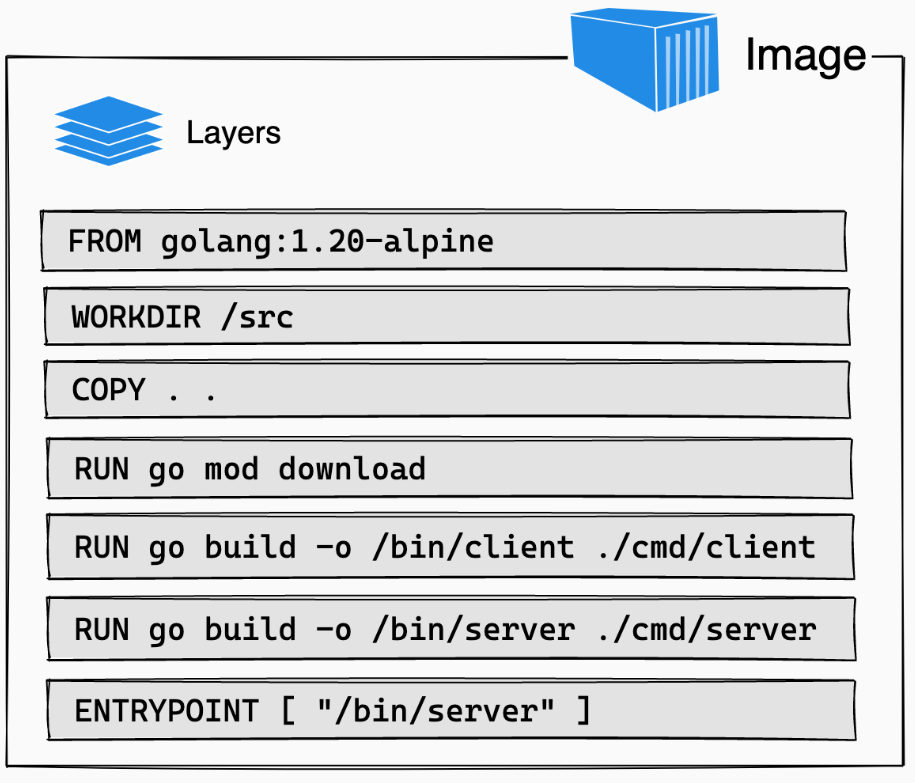
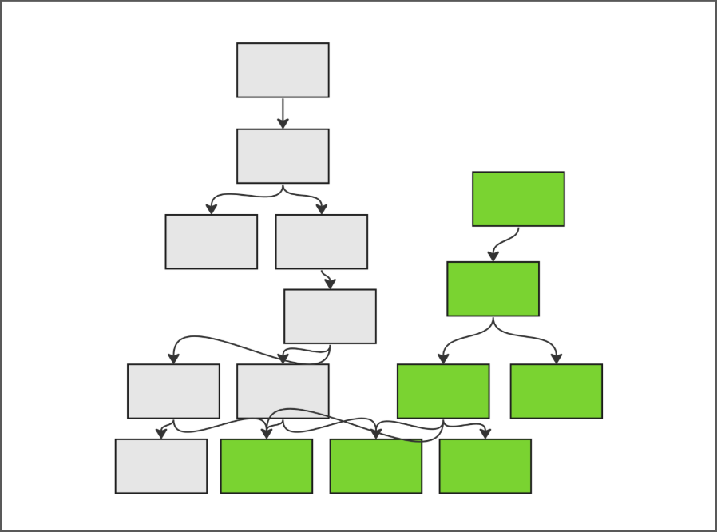

# what is nix
- functional programming language
  focused on inputs/outputs
- can execute programs/functions to build software
- tracks dependencies in a graph
- focuses on reproducibility and hermeticity

# hermetic????
"to seal or make airtight"
```
disable the network 
disable outside resources and files
reset the clock
wrap binaries with special ENV
precisely direct the library loader
hash everything!
```
This makes a software build very reproducible

# The power of nix is nixpkgs
[https://github.com/NixOS/nixpkgs/graphs/contributors](https://github.com/NixOS/nixpkgs/graphs/contributors)

- **22 years of contributors**
- 120,000 packages
- public build system + cache
- packages cross-built for amd/arm, linux/mac

<!-- 
# thanks to these people
My previous coworkers from Flox are so kind and smart
They got me rolling on my Nix journey.
- [https://github.com/bryanhonof](https://github.com/bryanhonof)
- [https://github.com/tomberek](https://github.com/tomberek)
-->

# Using Nix
- NixOS:
  - modules system with inputs
  - similar to Puppet
- home-manager / nix-darwin
- the language itself
- flakes

# Using Nix more easily
## flox,  devenv,  devbox
- these tools make nix more collaborative
- makes the onramp more uniform

(I used to work with the folks @ Flox)

<!--
Flox primer
Flox demo
-->

# comparison with containers
- **nix** is a great **packaging** technology:
  + safe linking of dependencies without sandboxing
  + reproducible
- containers are a great (linux) **runtime** technology
- containers are accidentally a packaging tool:
  + sandboxing prevents footguns
  + images are repeatably usable (usually not reproducible)

<!--
`flox containerize`
Kubernetes ImageVolumes
-->

# Bending Nix into Kubernetes
This Kubernetes demo shows how nix store-paths can be stored in OCI.

The big opportunity here is making dependencies across the entire software lifecycle
immutable!

If you download a dependency and do not change it, it creates a lot of entropy to
re-package it into a brand-new, aggregate artifact.


# Artifact Data Structure Comparison
- linked list of overlays with a layer limit
  + [moby/moby @ 23e5c94cfb26eb72c097892712d3dbaa93ee9bc0](https://github.com/moby/moby/commit/23e5c94cfb26eb72c097892712d3dbaa93ee9bc0)
- set of tracked fine-grained, non-overlapping dependencies
  + let's look at `lld` on `./make`

# Layers to Graphs
::: {style="float:left;width:50%;max-width:50%;"}

- `docker build`
    - linear
    - ordered list
    - leaves upon leaves

{width=80%}
:::

::: {style="float:right;width:50%;max-width:50%;"}
- `go build`, `npm build`, `nix build`, ...
    - tree-like
    - software re-use
    - distributed

{width=80%}
:::


# Nix's Big Idea:
## all of our dependencies
## can be immutable
## if we track them
Containers are defacto now.  
If we extend them to support  
non-conflicting shards of generic layers,  
Nix and containers can interoperate.

# How to fix it
### We need to teach...

# container runtimes (containerd, crio)
### how to use these store-paths from within an image manifest
+ (work past the layer limit)

# nix itself
### to pull and push blobs to OCI in a nix & container compatible way
+ (no more pulling dependencies, just to push them back to the cloud)
+ extend libstore:
  [NixOS/nix/tree/master/src/libstore](https://github.com/NixOS/nix/tree/master/src/libstore)

# container registries
### to serve up the proper nix archives and metadata
+ (nix binary caches win the benefits of the OCI ecosystem)

# nix-snapshotter
### POC nix-native container runtime extension

- doesn't know about OCI

## [pdtpartners/nix-snapshotter](https://github.com/pdtpartners/nix-snapshotter)

# oranc
### s3 shim for using OCI as a Nix Binary Cache

- doesn't format the content in a container friendly way

## [linyinfeng/oranc](https://github.com/linyinfeng/oranc)

# ImageVolumes demo from today
### Formats content in a container runtime friendly way

- doesn't interop with Nix natively
- requires new Kubernetes Alpha feature + kubelet tuning
- OCI image manifest/artifact info shouldn't be an ops config

## [stealthybox/crio-nix](https://github.com/stealthybox/crio-nix)

# If we can make Nix and Containers agree on Artifact, Transport, Runtime
## Cloud Native Nix
## could be the next big thing
